# General Assembly WDI Project 4: Orbital

[Heroku](https://orbital-dating.herokuapp.com/)

[GitHub Repo](https://github.com/platypotomus/wdi-project4-orbital)

## Brief
* Build a full-stack application by making your own backend and your own front-end
* Use an Express API to serve your data from a Mongo database
* Consume your API with a separate front-end built with React
* Be a complete product which most likely means multiple relationships and CRUD functionality for at least a couple of models
* Implement thoughtful user stories/wireframes that are significant enough to help you know which features are core MVP and which you can cut
* Have a visually impressive design to kick your portfolio up a notch and have something to wow future clients & employers. ALLOW time for this.
* Be deployed online so it's publicly accessible.
* Have automated tests for at least one RESTful resource on the back-end. Improve your employability by demonstrating a good understanding of testing principals.

## App Description
aflkjasdf;aflkjasdf

## Technologies Used
* HTML5
* SCSS
* JavaScript (ECMAScript 6)
* axios: v0.18.0
* babel-plugin-transform-class-properties: v6.24.1
* babel-plugin-transform-object-rest-spread: v6.26.0
* moment: v2.22.2
* react: v16.4.2
* react-dom: v16.4.2
* react-router-dom: v4.3.1
* Node.js
* MongoDB
* bcrypt: v3.0.0
* bluebird: v3.5.1
* body-parser: v1.18.3
* express: v4.16.3
* jsonwebtoken: v8.3.0
* mongoose: v5.2.10
* mongoose-unique-validator: v2.0.1
* morgan: v1.9.0
* request-promise: v4.2.2
* chai: v4.1.2
* mocha: v5.2.0
* nyc: v13.0.1
* supertest: v3.2.0
* Git
* GitHub
* Heroku
* Trello
* Photoshop
* Google Fonts
* Fontawesome

## APIs Used
* GIPHY
* MapQuest
* Nominatim

## Approach Taken

### Wireframes
I did these wireframes in Photoshop and kept them very simple.

#### Login
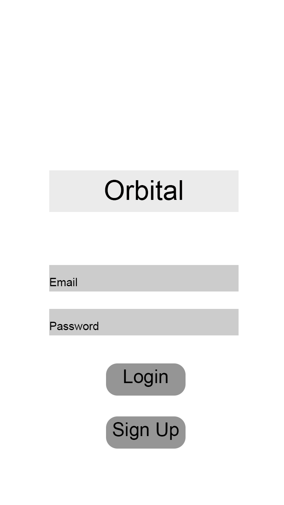

#### Users Index
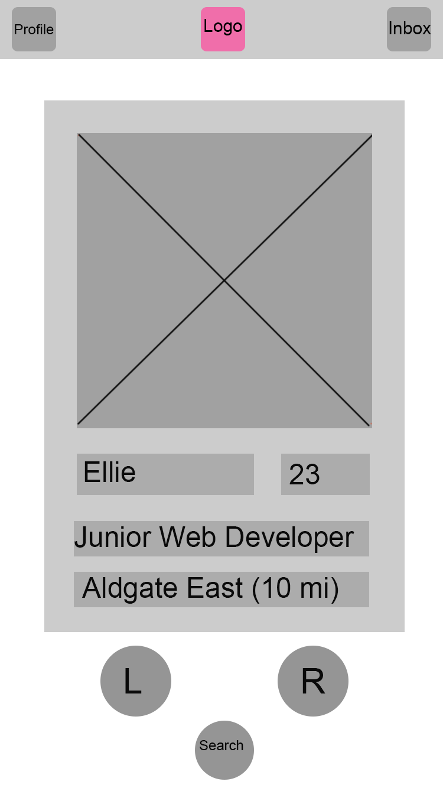

#### Users Show
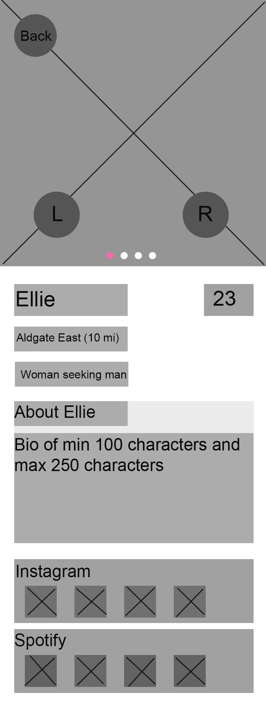

#### Profile Page
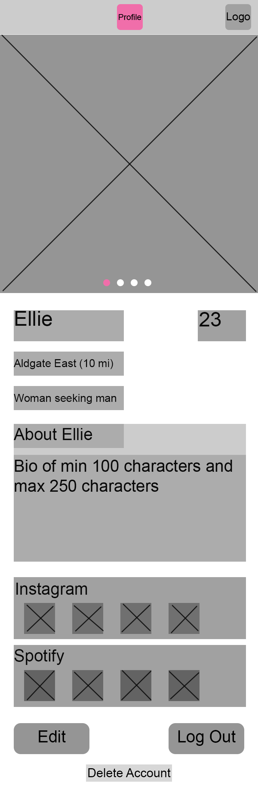

#### Chats and Swipes Index
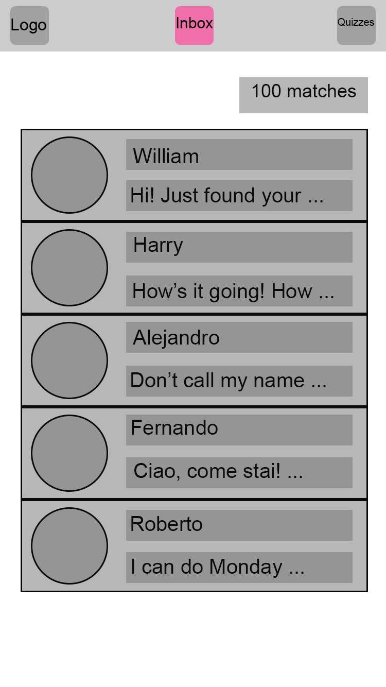

#### Chat Show
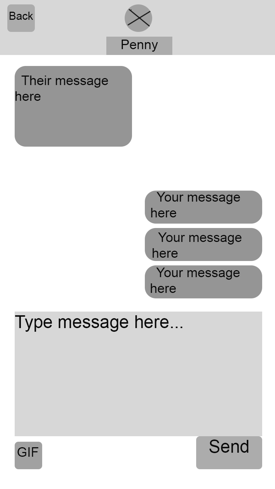

I organised my workload using a Trello board, which I found to be very helpful for planning and deciding which features to prioritise:

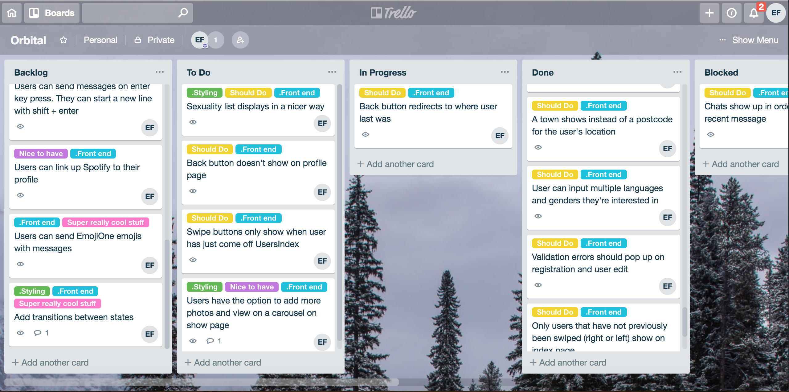

### Functionality

#### Back End

#### Front End

### Styling

### Finished Product

#### Login
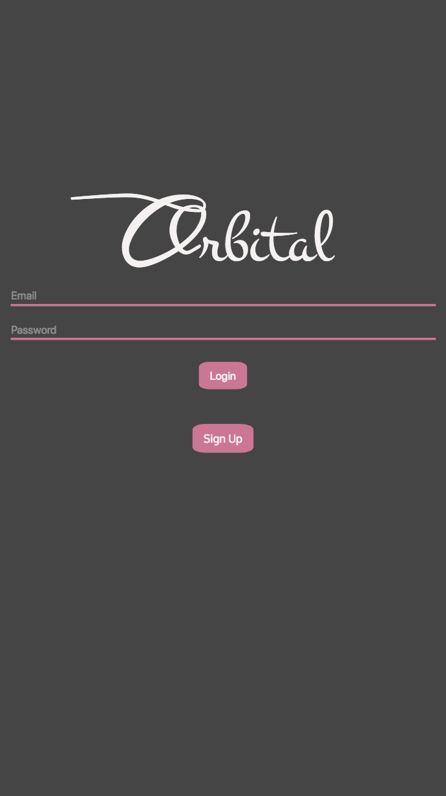

#### Registration
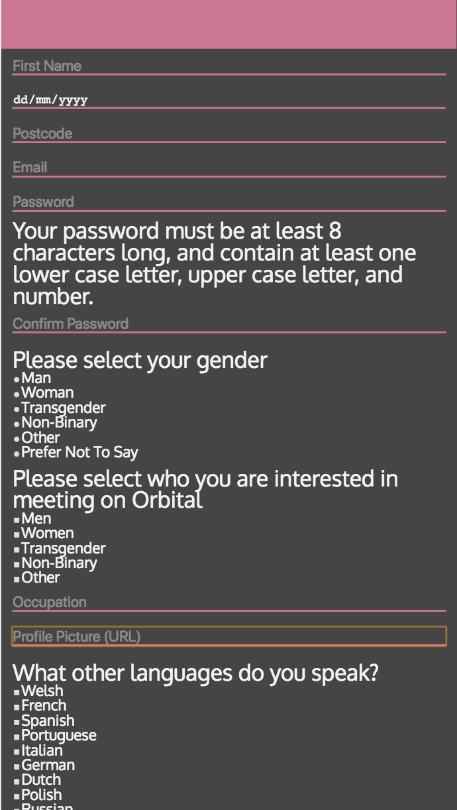

#### Users Index

#### User Show
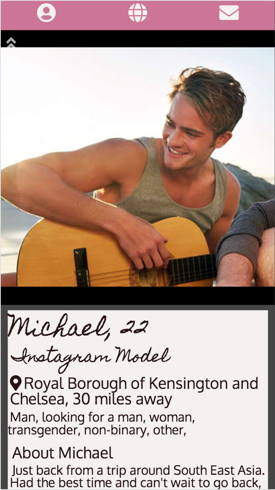

#### Chats and Swipes Index
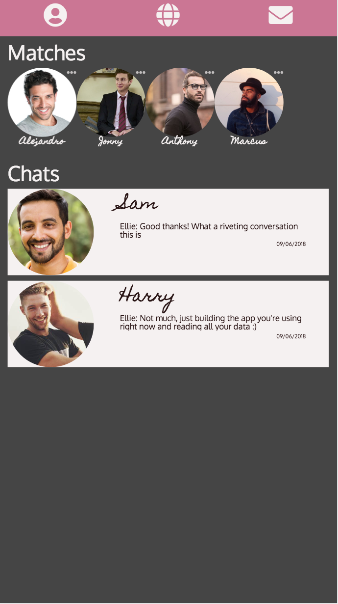

#### Chat Show
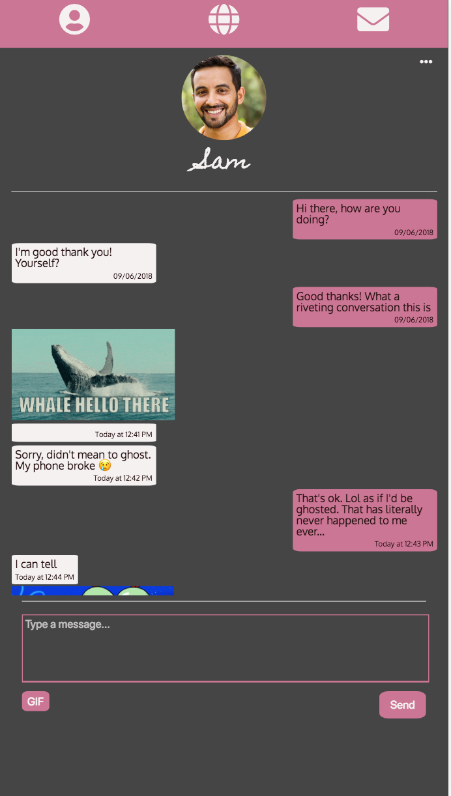

#### Chat Show with Gif Search
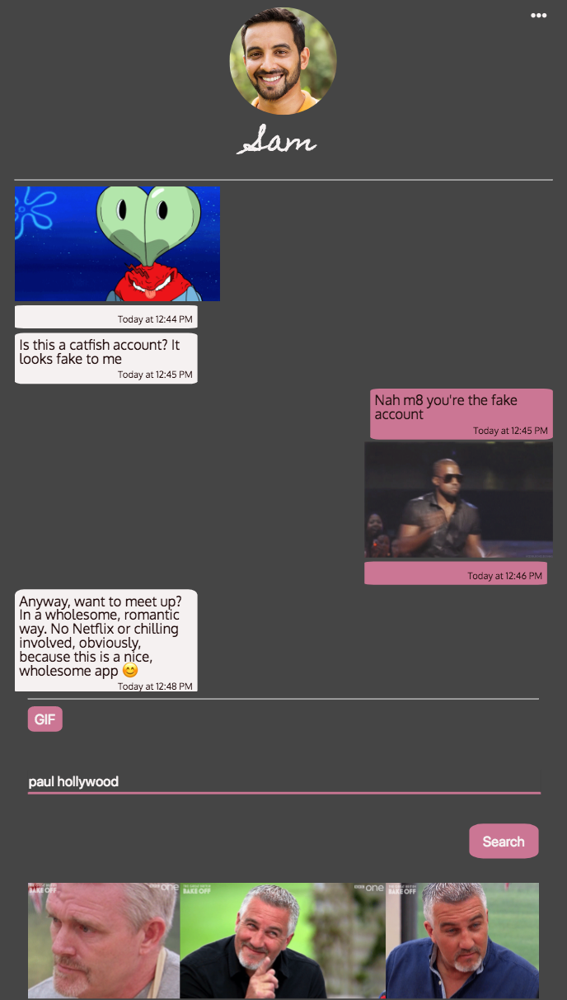
