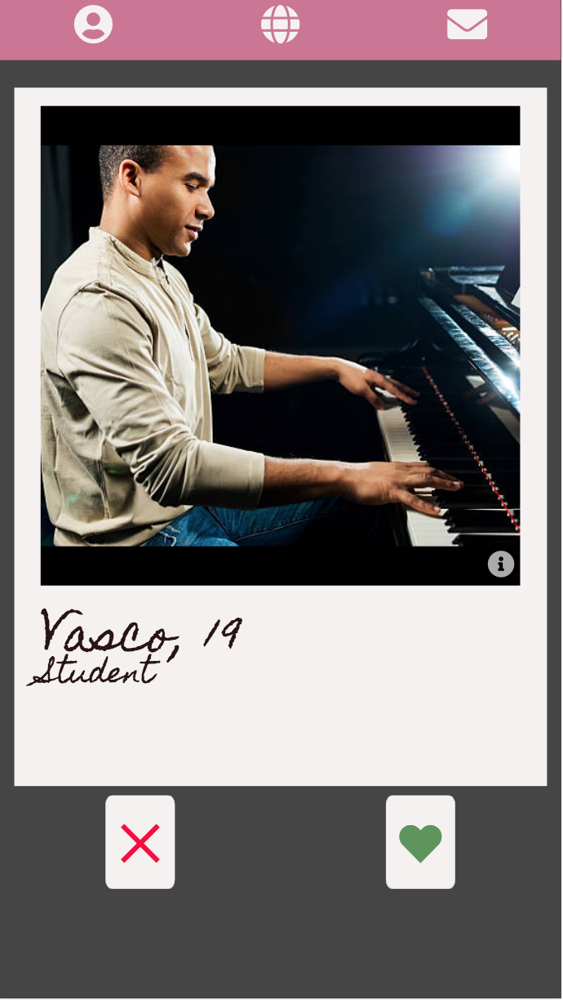

[Heroku](https://orbital-dating.herokuapp.com/)

[GitHub Repo](https://github.com/platypotomus/wdi-project4-orbital)

Orbital is a one-page, MERN stack dating app, designed mobile first. It works with a Tinder-esque right/left matching system, in which users tap the button on the right to "like" the other user's profile, or left to "dislike" it. Only if both users tap right for each other are they granted permission to message each other. Orbital's built-in messenger integrates GIPHY, thus allowing users to send gifs to one another; as well as the usual timestamped, text-based message.

### Login


### Users Index



### User Show


### Chats and Swipes Index


### Chat Show


### Chat Show with Gif Search


---

## Brief
* Build a full-stack application by making your own backend and your own front-end
* Use an Express API to serve your data from a Mongo database
* Consume your API with a separate front-end built with React
* Be a complete product which most likely means multiple relationships and CRUD functionality for at least a couple of models
* Implement thoughtful user stories/wireframes that are significant enough to help you know which features are core MVP and which you can cut
* Have a visually impressive design to kick your portfolio up a notch and have something to wow future clients & employers. ALLOW time for this.
* Be deployed online so it's publicly accessible.
* Have automated tests for at least one RESTful resource on the back-end. Improve your employability by demonstrating a good understanding of testing principals.

## Technologies Used
* HTML5
* SCSS
* JavaScript (ECMAScript 6)
* axios: v0.18.0
* babel-plugin-transform-class-properties: v6.24.1
* babel-plugin-transform-object-rest-spread: v6.26.0
* moment: v2.22.2
* react: v16.4.2
* react-dom: v16.4.2
* react-router-dom: v4.3.1
* Node.js
* MongoDB
* bcrypt: v3.0.0
* bluebird: v3.5.1
* body-parser: v1.18.3
* express: v4.16.3
* jsonwebtoken: v8.3.0
* mongoose: v5.2.10
* mongoose-unique-validator: v2.0.1
* morgan: v1.9.0
* request-promise: v4.2.2
* chai: v4.1.2
* mocha: v5.2.0
* nyc: v13.0.1
* supertest: v3.2.0
* Git
* GitHub
* Heroku
* Trello
* Photoshop
* Google Fonts
* Fontawesome


## APIs Used
* GIPHY
* MapQuest
* Nominatim


## Approach Taken

### Wireframes
The wireframes were put together in Photoshop.


#### Login


#### Users Index


#### Users Show


#### Profile Page


#### Chats and Swipes Index


#### Chat Show


## Functionality
I organised my workload using a Trello board:


### Back End
I began with the back end, with the aim to have as strong and stable a back end as possible before rendering anything to the page. I also wanted the back end to do as much work as possible. I managed to get most of the back end working in a few days, apart from the gifController and photoController (which were both extras so came later). I tested at least one route in every controller apart from these two.

### Featured Piece of Code no. 1
This is the best visualisation of how I dealt with swipes. It's from swipes that one determines if two users have permission to message each other or not. In my previous project, we used a few arrays, to which user Ids would be pushed and filtered, to deal with the friend requests. Here, I used a single array of objects, which allowed me to store more information. From [./models/user.js](https://github.com/platypotomus/wdi-project4-orbital/blob/master/models/user.js).

```javascript
swipes: [
  {
    userId: { type: mongoose.Schema.ObjectId, ref: 'User' },
    status: { type: String, enum: ['right', 'left'] },
    mutual: { type: Boolean, default: false },
    messaged: { type: Boolean, default: false },
    timestamps: { type: String, default: moment().format('YYYY-MM-dd HH:mm') }
  }
]
```

### Featured Piece of Code no. 2
In `getTokenFromHttpRequest`, I made an object with some of the logged in user's data, which I saved to the token. I then used the Mongoose find() method to filter according to this, so they only see users according to their set preferences. From [./controllers/userController.js](https://github.com/platypotomus/wdi-project4-orbital/blob/master/controllers/userController.js)

```javascript
function usersIndex(req, res, next) {
  getTokenFromHttpRequest(req);

  User
    .find({ $and: [ {sexuality: {$in: userObject.gender}}, {gender: {$in: userObject.sexuality}}, {_id: {$ne: userObject.userId, $nin: userObject.swipeIds}} ] } )
    .then(users => res.json(users))
    .catch(err => console.log(`There was an error ${err}`))
    .finally(next);
}
```

### Front End
With front end, I worked on rendering the user pages, before getting the swipes and chats working. I finished a basic front end in a couple of days, which left me time to add extra features such as the photo carousel and GIPHY integration.


### Styling
I left almost all the styling until the very end. I decided not to use a framework this time, and just use pure SCSS with positions, dimensions, and the box model. The colour scheme came about somewhat by accident, but I kept it for its 'chalkboard' effect. I uesed three Google fonts: Meddon and Homemade Apple for the logo, Homemade Apple for the main headings and user info, and Oxygen for the rest.


## Wins and Blockers
The messenger was a huge win. I was incredibly nervous about building it, yet it happened pretty smoothly. I'm especially pleased with how it looks on the page with the different colours and alignments. Perhaps somewhat weirdly, I found floats and clears to be lifesavers as they allowed me to mess with the message bubbles' horizontal alignment, whilst keeping the vertical the same. Integrating GIPHY was another win here. I thought it would take longer than it did. Although I did research it and look at the data ahead of time.

Back end testing was another win. I struggled with it in my previous project, but not only did I find it much more straight forward this time, but I genuinely found it very helpful.

The biggest blocker was the matching system, both on the front and back ends. There are several possibilities of what can happen between two users, so it was very fiddly to account for that, and update data for both affected users.

Styling both without a framework and without flexbox was also a challenge, given how important responsiveness was. Whilst I plan to work on the responsiveness, I'm happy with how it looks. Not using a framework gave me a lot more freedom to style a beautiful app that doesn't just look like another Bulma or Bootstrap app.


## Future Features
There are lots of features I'm planning on adding to Orbital, including:

* An actual 'swipe' event listener - with animations - instead of tap buttons.
* Integrate a websocket so the other user's messages can be viewed immediately, without refreshing the page.
* Ordering chats on the chats index page in order of their most recent message.
* Showing just a preview of the most recent message on the chats index, and not the whole thing.
* Push notifications.
* Integrating EmojiOne, for a more unique emoji experience.
* Allow users to link up their Instagram and/or Spotify accounts to their profile.
* A built-in gaming feature, like a mini Facebook quizzes or Sporcle, with the option to challenge other users.
* Improved responsiveness.
